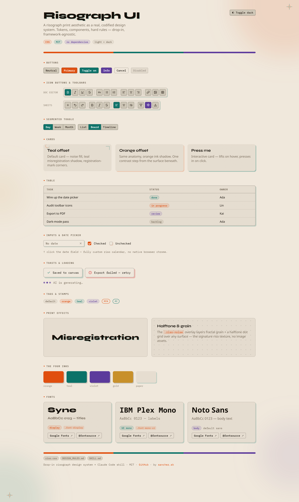

# Risograph UI

**A Risograph print aesthetic as a real, codified UI design system — not a one-off filter.**

The risograph *look* is everywhere (grain, ink bleed, misregistration, halftones) — on posters, zines, album covers. What's rare is riso treated as an actual **design system**: tokens, components, and hard numeric rules you build a whole app on, the way you'd use Material or shadcn.

This is that. Free, MIT, framework-agnostic.

**▶ [Live demo](https://sanchezalvarez.github.io/risograph-design-system/demo.html)** — every component on one page, with a working calendar, toolbars, and dark mode. (Or just open [`demo.html`](./demo.html) locally — no build needed.)

```
◆ offset "misregistration" shadows  ◆ grain noise on every surface (inline SVG, no images)
◆ tactile press-in buttons          ◆ corner registration marks + ◆ markers
◆ a tight 4-ink palette             ◆ punchy entrance/interaction animations
```

<!-- Add a screenshot for extra punch: drop a `demo.png` next to this file and uncomment:

-->

## What's in here

| File | What it is |
|------|------------|
| **`riso.css`** | Drop-in design tokens + component classes. Light + dark, self-contained plain CSS — no build step, no images, no dependencies. |
| **`DESIGN_RULES.md`** | The hard numeric rules: control heights, dropdown widths, spacing scale, typography sizes, anti-patterns. The part that makes it a *system* and not a vibe. |
| **`SKILL.md`** | A [Claude Code](https://claude.com/claude-code) skill — drop the folder into `.claude/skills/` and Claude will audit/apply the look for you. |
| **`demo.html`** | Open it in a browser to see everything at once (no build needed). |

## Quick start

1. Copy `riso.css` into your project and import it once at the app root:
   ```css
   @import "./riso.css";
   ```
2. Toggle dark mode by adding the class `dark` to `<html>` or `<body>`.
3. Build from the bundled classes — never from raw utility classes:
   ```html
   <button class="btn-tactile btn-tactile-orange">Ship it</button>
   <div class="card-riso card-riso-teal">…</div>
   <span class="riso-section-label">Section</span>
   ```
4. Follow [`DESIGN_RULES.md`](./DESIGN_RULES.md) for every dimension decision.

Open [`demo.html`](./demo.html) to see the full component set rendered.

## The hard rules (excerpt)

Numbers are what keep it coherent — don't improvise sizes from "what looks balanced":

- **Control heights** bucket to **22 / 26 / 32px** — never mix two buckets in one horizontal row.
- **Dropdowns with names**: `min-width: 200px`, never `w-auto`.
- **One spacing scale**: `2 / 4 / 8 → 12 / 16 → 20 / 24 → 32 / 40`.
- **One easing curve** for every animation: `cubic-bezier(0.22, 1, 0.36, 1)`.
- **Colours via tokens only** — never raw hex or framework palette classes.

Full ruleset + anti-patterns in [`DESIGN_RULES.md`](./DESIGN_RULES.md).

## The palette

Four "inks" over warm paper, each with a semantic role:

| Ink | Token | Role |
|-----|-------|------|
| 🟠 Orange | `--accent-orange` | primary action, selection, active tint |
| 🟢 Teal | `--accent-teal` | confirmed / toggle-on, date picker |
| 🟣 Violet | `--accent-violet` | information / neutral markers |
| 🟡 Gold | `--accent-gold` | warning / pending |

## Stack notes

`riso.css` is plain custom properties + classes — works with **anything** (vanilla, React, Vue, Svelte…). The examples in `DESIGN_RULES.md` reference **React + Tailwind v4 + Radix** because that's where the tricky integration points show up (overriding a primitive's baked-in height, portalling popovers out of clipping containers). Nothing depends on a framework.

Using Tailwind v4? Map the tokens into your theme:
```css
@theme inline {
  --color-background: var(--background);
  --color-accent-orange: var(--accent-orange);
  /* … */
}
```

## Fonts

Two display fonts are referenced — install them or swap the fallbacks:
- **Syne** (`.font-display`) — titles
- **IBM Plex Mono** (`.font-mono-ui`) — labels, buttons, chips

Both are free (Google Fonts / Fontsource). Everything degrades gracefully without them.

## License

[MIT](./LICENSE) — copy, fork, ship, sell. No attribution required (but a star is appreciated ⭐).

---

If you ship something with it, I'd genuinely love to see riso escape the poster/zine world and end up in real product UI. 🖨️

Made by [sanchez.sk](https://www.sanchez.sk).
